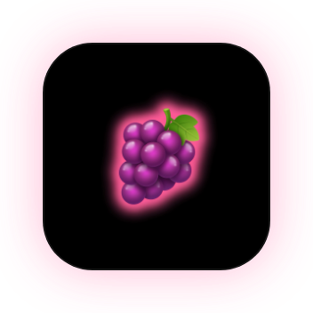
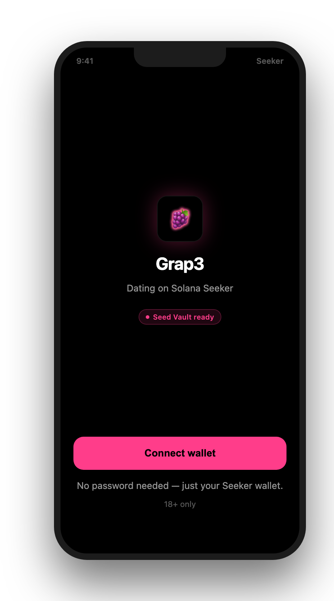
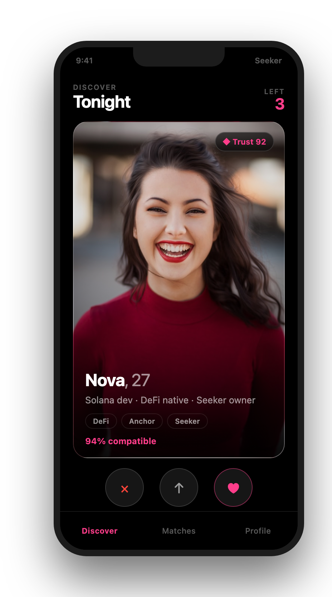
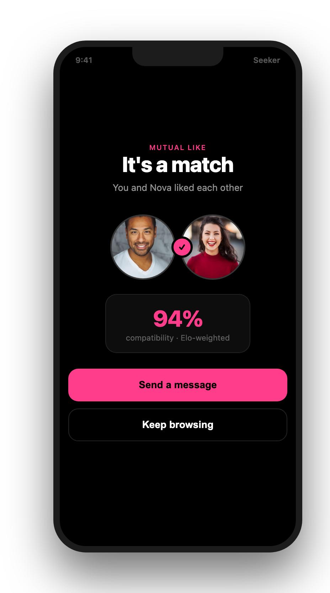
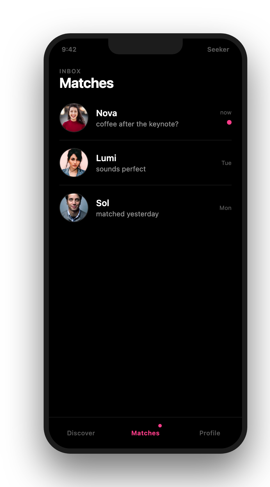

<div align="center">



# Grap3

**Wallet-first dating for Solana Seeker**

Connect with Seed Vault, match on-chain verified singles, chat end-to-end encrypted, pay in USDC or SOL.

[](https://solanamobile.com/)
[](./LICENSE)
[](./docs/mockup/preview.html)

</div>

---

## UI / UX highlights

<p align="center">
  
  
  
  
</p>

---

## Features

| | |
|---|---|
| **Seed Vault auth** | Sign in with your Seeker wallet. No email, no passwords. |
| **On-chain trust** | Wallet age, activity & holdings as anti-bot signals. |
| **Smart matching** | Elo ranking + compatibility + Gale-Shapley stable pairs. |
| **Encrypted chat** | Wallet-key secured messaging with live presence. |
| **Crypto payments** | Boosts & premium in USDC/SOL — zero app-store tax. |
| **Seeker-native UI** | True black OLED, `#FF3D8A` grape glow, minimal chrome. |

## Tech stack

| Layer | Stack |
|-------|-------|
| Mobile | React Native · Expo · Solana Mobile Wallet Adapter |
| Backend | Node.js · Express · Prisma · PostgreSQL |
| Realtime | WebSockets — matches, typing, presence |
| Chain | Solana mainnet/devnet — SOL & USDC treasury |

## Quick start

```bash
cd backend && npm install && npm run dev
cd app && npm install --legacy-peer-deps && npm run android
```

→ Full guide: [docs/SETUP.md](./docs/SETUP.md)

## Documentation

| Topic | Link |
|-------|------|
| **UI / UX samples** | [docs/mockup/preview.html](./docs/mockup/preview.html) · [docs/UI.md](./docs/UI.md) |
| Architecture | [docs/ARCHITECTURE.md](./docs/ARCHITECTURE.md) |
| Technical spec | [docs/TECH_SPEC.md](./docs/TECH_SPEC.md) |
| Matching algorithm | [docs/ALGORITHM.md](./docs/ALGORITHM.md) |
| Roadmap | [docs/ROADMAP.md](./docs/ROADMAP.md) |
| Business model | [docs/BUSINESS_MODEL.md](./docs/BUSINESS_MODEL.md) |
| Go-to-market | [docs/GTM.md](./docs/GTM.md) |
| Security | [docs/SECURITY.md](./docs/SECURITY.md) |
| dApp Store publish | [docs/DAPP_STORE.md](./docs/DAPP_STORE.md) · [docs/RELEASE.md](./docs/RELEASE.md) |
| Setup checklist | [docs/REQUIREMENTS_CHECKLIST.md](./docs/REQUIREMENTS_CHECKLIST.md) |
| Contributing | [docs/CONTRIBUTING.md](./docs/CONTRIBUTING.md) · [docs/CONTRIBUTORS.md](./docs/CONTRIBUTORS.md) |

## Project structure

```
grap3/
├── app/          # React Native dApp (Seeker)
├── backend/      # API + Prisma
├── docs/         # Specs, UI samples, publishing guides
└── .github/      # CI
```

## License

MIT © Grap3 Labs